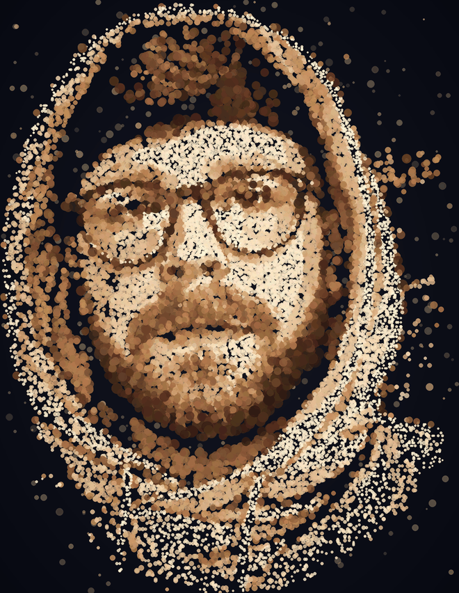

<table>
<tr>
<td width="340" valign="middle">

</td>
<td valign="middle">

# Hey, I'm Nick 👋

**Lead Software Engineer** in London who likes making the web feel a little more alive — 3D, motion, and the boring reliability that makes it all actually ship.

- 🎪 Building [**iamnick.dev**](https://iamnick.dev) — a scroll-driven 3D carnival portfolio in React Three Fiber
- 🛠️ Leading engineering at [**Travelex**](https://travelex.com)
- 🧪 Happiest where performance, delightful UX and WebGL meet
- 💬 Ask me about React, TypeScript, Three.js, or shipping ambitious front-ends
- 🖼️ Yes, that portrait is ~20,000 clustered circles, generated from a photo

</td>
</tr>
</table>

### 🧰 Tech I reach for

### 📊 GitHub in numbers

### 🤝 Find me

🎠 Roll up, roll up — step right into the code.
